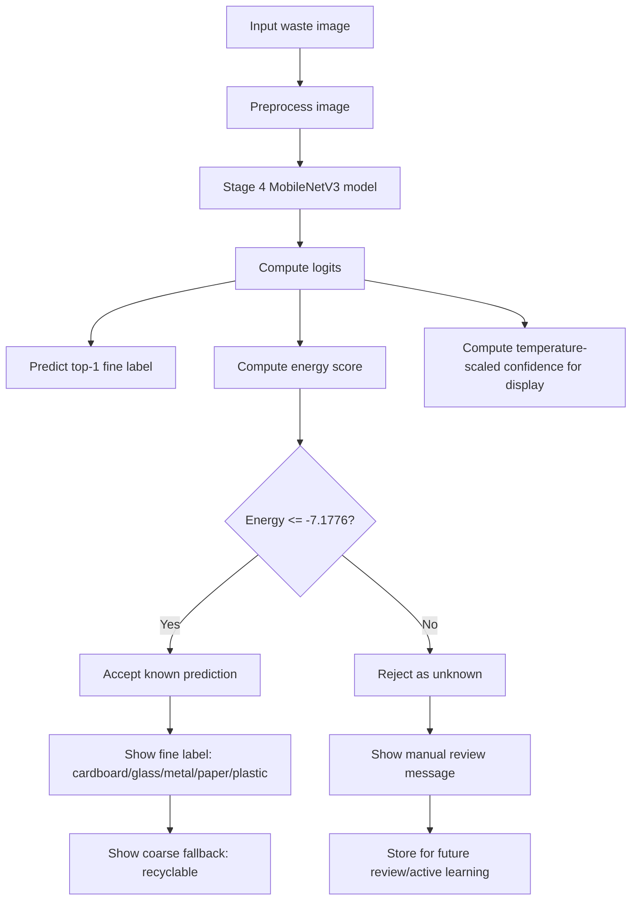

# Final Decision Policy v1

## Purpose

This document defines the final OpenWaste-HR decision policy used after model inference.

The final model is not used as a simple closed-set classifier. Instead, it uses an uncertainty-aware reject option so that unknown items are not forced into one of the five known classes.

## Known Classes

The model supports five known fine labels:

- cardboard
- glass
- metal
- paper
- plastic

Each known fine label maps to the same coarse fallback category:

| Fine label | Coarse label |
|---|---|
| cardboard | recyclable |
| glass | recyclable |
| metal | recyclable |
| paper | recyclable |
| plastic | recyclable |

## Unknown Classes Used for Evaluation

The held-out unknown/open-set classes are:

- biological
- textile

These classes are not used for known-class training.

## Selected Reject Method

The final reject-option method is energy scoring.

| Item | Value |
|---|---:|
| Method | Energy score |
| Threshold | -7.1776 |
| Direction | lower is known |
| Known test coverage | 0.7665 |
| Unknown test rejection rate | 0.8500 |
| Accepted-known accuracy | 0.9791 |
| Test AUROC | 0.8789 |

## Decision Rule

The final decision rule is:

```text
If energy <= -7.1776:
    accept the model prediction as a known fine label
    show the fine label and recyclable fallback

Else:
    reject the prediction
    show unknown/manual review
```

## Decision Flow Diagram



## User-Facing Behaviour

### Accepted known prediction

When the image is accepted as known, the system may show:

```text
This item is likely plastic. It belongs to the recyclable category.
```

### Rejected unknown prediction

When the image is rejected, the system should not show the model's top-1 class as a confident answer. Instead, it should show:

```text
The system is not confident that this item belongs to the supported known classes. Please send it for manual review.
```

## Why This Policy Is Needed

Without a reject option, every textile or biological image would be forced into cardboard, glass, metal, paper, or plastic. This would make the system unsafe and misleading in open-world use.

The energy-based reject policy reduces this risk by rejecting uncertain or out-of-distribution inputs instead of forcing a closed-set prediction.

## Final Policy Status

This policy is the final decision layer for the current OpenWaste-HR model.

Future optional work may add a local unknown/stress test dataset, but the core reject-option protocol uses the held-out public unknown classes: textile and biological.
