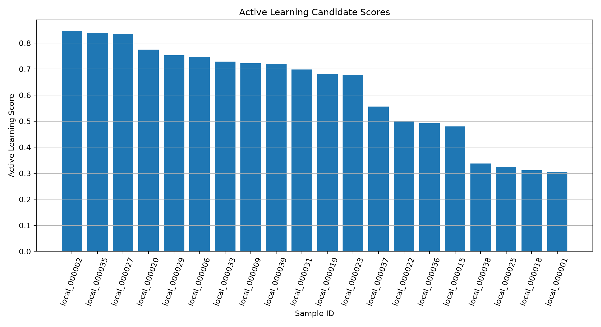

# Active Learning Candidate Selection v1 Report

## Purpose

This report lists the local unknown dataset images selected for human labelling.

The selection prioritises samples that are useful for improving the OpenWaste-HR uncertainty and manual-review pipeline.

## Candidate Summary

| metric | value |
| --- | --- |
| selected_candidate_count | 20.0 |
| manual_review_candidates | 12.0 |
| coarse_label_candidates | 4.0 |
| fine_label_candidates | 4.0 |
| mean_active_learning_score | 0.616382 |
| max_active_learning_score | 0.846766 |
| min_active_learning_score | 0.306373 |

## Candidate Distribution

| decision_type | candidate_count | percentage |
| --- | --- | --- |
| manual_review | 12 | 60.0 |
| coarse_label | 4 | 20.0 |
| fine_label | 4 | 20.0 |

## Selected Candidates

| candidate_rank | sample_id | hierarchical_decision_type | hierarchical_final_label | pred_label | max_softmax_confidence | active_learning_score | active_learning_reason |
| --- | --- | --- | --- | --- | --- | --- | --- |
| 1 | local_000002 | manual_review | manual_review | residual | 0.381314 | 0.846766 | manual_review_candidate |
| 2 | local_000035 | manual_review | manual_review | metal | 0.261482 | 0.839029 | manual_review_candidate |
| 3 | local_000027 | manual_review | manual_review | plastic | 0.292679 | 0.834844 | manual_review_candidate |
| 4 | local_000020 | manual_review | manual_review | metal | 0.405149 | 0.774892 | manual_review_candidate |
| 5 | local_000029 | manual_review | manual_review | plastic | 0.422092 | 0.75257 | manual_review_candidate |
| 6 | local_000006 | manual_review | manual_review | paper_cardboard | 0.511699 | 0.747066 | manual_review_candidate |
| 7 | local_000033 | manual_review | manual_review | metal | 0.53448 | 0.728483 | manual_review_candidate |
| 8 | local_000009 | manual_review | manual_review | metal | 0.488698 | 0.722906 | manual_review_candidate |
| 9 | local_000039 | manual_review | manual_review | metal | 0.501406 | 0.719005 | manual_review_candidate |
| 10 | local_000031 | manual_review | manual_review | metal | 0.587727 | 0.697844 | manual_review_candidate |
| 11 | local_000019 | manual_review | manual_review | glass | 0.528726 | 0.680643 | manual_review_candidate |
| 12 | local_000023 | manual_review | manual_review | plastic | 0.630441 | 0.677636 | manual_review_candidate |
| 13 | local_000037 | coarse_label | recyclable | metal | 0.671704 | 0.556322 | coarse_fallback_unknown_candidate |
| 14 | local_000022 | coarse_label | recyclable | paper_cardboard | 0.724571 | 0.498591 | coarse_fallback_unknown_candidate |
| 15 | local_000036 | coarse_label | recyclable | paper_cardboard | 0.78168 | 0.492698 | coarse_fallback_unknown_candidate |
| 16 | local_000015 | coarse_label | recyclable | plastic | 0.743137 | 0.480001 | coarse_fallback_unknown_candidate |
| 17 | local_000038 | fine_label | paper_cardboard | paper_cardboard | 0.925384 | 0.337306 | fine_accepted_unknown_candidate |
| 18 | local_000025 | fine_label | plastic | plastic | 0.941281 | 0.323408 | fine_accepted_unknown_candidate |
| 19 | local_000018 | fine_label | plastic | plastic | 0.957104 | 0.311263 | fine_accepted_unknown_candidate |
| 20 | local_000001 | fine_label | plastic | plastic | 0.962933 | 0.306373 | fine_accepted_unknown_candidate |

## Candidate Score Plot

## Research Interpretation

The selected candidates form the next human-labelling batch.

Manual-review candidates help confirm genuinely uncertain samples. Coarse-label candidates help check whether broad fallback is safe. Fine-label candidates help identify cases where the model confidently accepted a local unknown image as a known label.

This supports the OpenWaste-HR active learning loop by turning uncertain and risky local cases into labelled feedback for later improvement.
