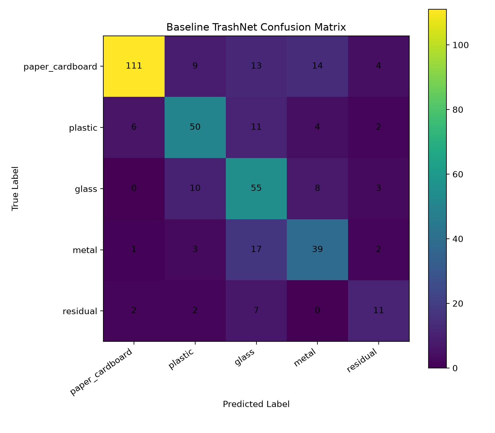

# Baseline TrashNet Evaluation v1

## Model

| Item | Value |
|---|---|
| Checkpoint | `ml/outputs/checkpoints/baseline_trashnet_v1/baseline_trashnet_best.pt` |
| Model type | Closed-set forced-choice classifier |
| Dataset | TrashNet mapped into OpenWaste-HR taxonomy |
| Label level | Fine label |
| Number of classes | 5 |
| Classes | paper_cardboard, plastic, glass, metal, residual |

## Main Test Metrics

| metric | value |
| --- | --- |
| accuracy | 0.692708 |
| balanced_accuracy | 0.654549 |
| macro_f1 | 0.645632 |
| weighted_f1 | 0.700885 |

## Classification Report

| label | precision | recall | f1-score | support |
| --- | --- | --- | --- | --- |
| paper_cardboard | 0.925 | 0.735099 | 0.819188 | 151.0 |
| plastic | 0.675676 | 0.684932 | 0.680272 | 73.0 |
| glass | 0.533981 | 0.723684 | 0.614525 | 76.0 |
| metal | 0.6 | 0.629032 | 0.614173 | 62.0 |
| residual | 0.5 | 0.5 | 0.5 | 22.0 |
| accuracy | 0.692708 | 0.692708 | 0.692708 | 0.692708 |
| macro avg | 0.646931 | 0.654549 | 0.645632 | 384.0 |
| weighted avg | 0.72339 | 0.692708 | 0.700885 | 384.0 |

## Confusion Matrix

## Research Interpretation

This is the first closed-set baseline. It always predicts one of the known TrashNet-derived fine labels.

This result should not be treated as the final OpenWaste-HR contribution. It is the comparison point for later experiments involving confidence-based rejection, unknown detection, hierarchical coarse fallback, and local active learning.

Important limitation: this TrashNet baseline does not include organic or e-waste/battery classes, and it does not test unknown rejection.
