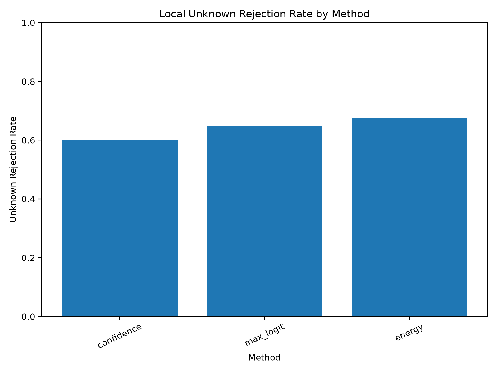
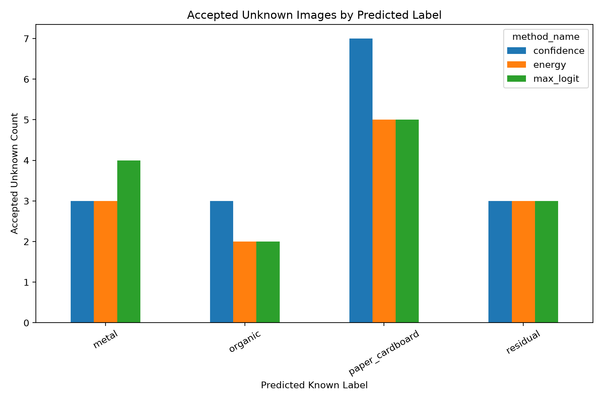

# Local Unknown Evaluation v1

## Purpose

This report evaluates whether the current OpenWaste-HR reject baselines can route local phone-captured unknown images to manual review.

## Known Labels Used by the Model

paper_cardboard, plastic, glass, metal, organic, residual

## Thresholds Used

Thresholds were selected from validation data in earlier experiments. The local unknown set was not used for threshold selection.

| method_name | score_column | threshold | accept_direction |
| --- | --- | --- | --- |
| confidence | max_softmax_confidence | 0.99 | greater_equal |
| max_logit | max_logit_score | 9.59305 | greater_equal |
| energy | energy_score | -9.870391 | less_equal |

## Unknown Rejection Metrics

| method_name | total_unknown_samples | rejected_unknown_count | accepted_unknown_as_known_count | unknown_rejection_rate | unknown_false_acceptance_rate |
| --- | --- | --- | --- | --- | --- |
| confidence | 40 | 24 | 16 | 0.6 | 0.4 |
| max_logit | 40 | 26 | 14 | 0.65 | 0.35 |
| energy | 40 | 27 | 13 | 0.675 | 0.325 |

## Accepted Unknown Label Distribution

| method_name | pred_label | accepted_count | accepted_percentage_within_method |
| --- | --- | --- | --- |
| confidence | metal | 3 | 18.75 |
| confidence | organic | 3 | 18.75 |
| confidence | paper_cardboard | 7 | 43.75 |
| confidence | residual | 3 | 18.75 |
| energy | metal | 3 | 23.08 |
| energy | organic | 2 | 15.38 |
| energy | paper_cardboard | 5 | 38.46 |
| energy | residual | 3 | 23.08 |
| max_logit | metal | 4 | 28.57 |
| max_logit | organic | 2 | 14.29 |
| max_logit | paper_cardboard | 5 | 35.71 |
| max_logit | residual | 3 | 21.43 |

## Rejection Rate Plot

## Accepted Label Distribution Plot

## Research Interpretation

For unknown evaluation, rejection/manual review is the desired behaviour.

Accepted unknown samples are treated as false accepts because the system forced a local unknown item into a known fine label. This result is important because it tests the actual OpenWaste-HR motivation: avoiding unsafe forced predictions on unknown or locally shifted inputs.
