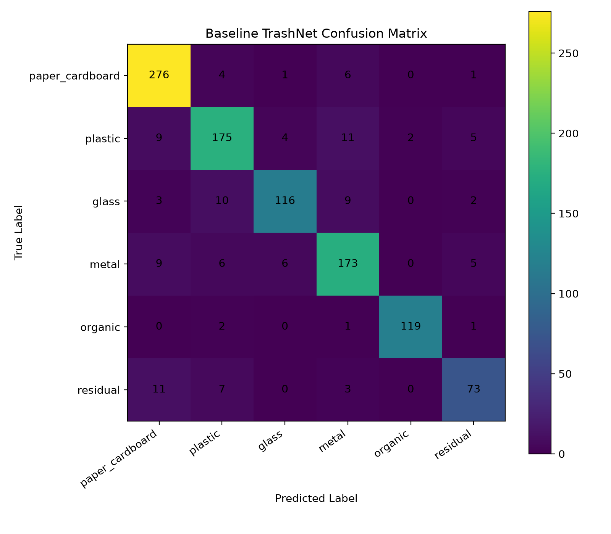

# Baseline TrashNet Evaluation v1

## Model

| Item | Value |
|---|---|
| Checkpoint | `ml/outputs/checkpoints/expanded_public_pretrained_v1/expanded_public_pretrained_v1_best.pt` |
| Model type | Closed-set forced-choice classifier |
| Dataset | TrashNet mapped into OpenWaste-HR taxonomy |
| Label level | Fine label |
| Number of classes | 6 |
| Classes | paper_cardboard, plastic, glass, metal, organic, residual |

## Main Test Metrics

| metric | value |
| --- | --- |
| accuracy | 0.887619 |
| balanced_accuracy | 0.874974 |
| macro_f1 | 0.881914 |
| weighted_f1 | 0.886969 |

## Classification Report

| label | precision | recall | f1-score | support |
| --- | --- | --- | --- | --- |
| paper_cardboard | 0.896104 | 0.958333 | 0.926174 | 288.0 |
| plastic | 0.857843 | 0.849515 | 0.853659 | 206.0 |
| glass | 0.913386 | 0.828571 | 0.868914 | 140.0 |
| metal | 0.852217 | 0.869347 | 0.860697 | 199.0 |
| organic | 0.983471 | 0.96748 | 0.97541 | 123.0 |
| residual | 0.83908 | 0.776596 | 0.80663 | 94.0 |
| accuracy | 0.887619 | 0.887619 | 0.887619 | 0.887619 |
| macro avg | 0.89035 | 0.874974 | 0.881914 | 1050.0 |
| weighted avg | 0.887714 | 0.887619 | 0.886969 | 1050.0 |

## Confusion Matrix

## Research Interpretation

This is the first closed-set baseline. It always predicts one of the known TrashNet-derived fine labels.

This result should not be treated as the final OpenWaste-HR contribution. It is the comparison point for later experiments involving confidence-based rejection, unknown detection, hierarchical coarse fallback, and local active learning.

Important limitation: this TrashNet baseline does not include organic or e-waste/battery classes, and it does not test unknown rejection.
