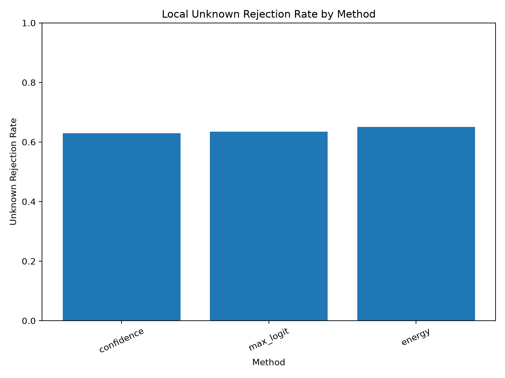
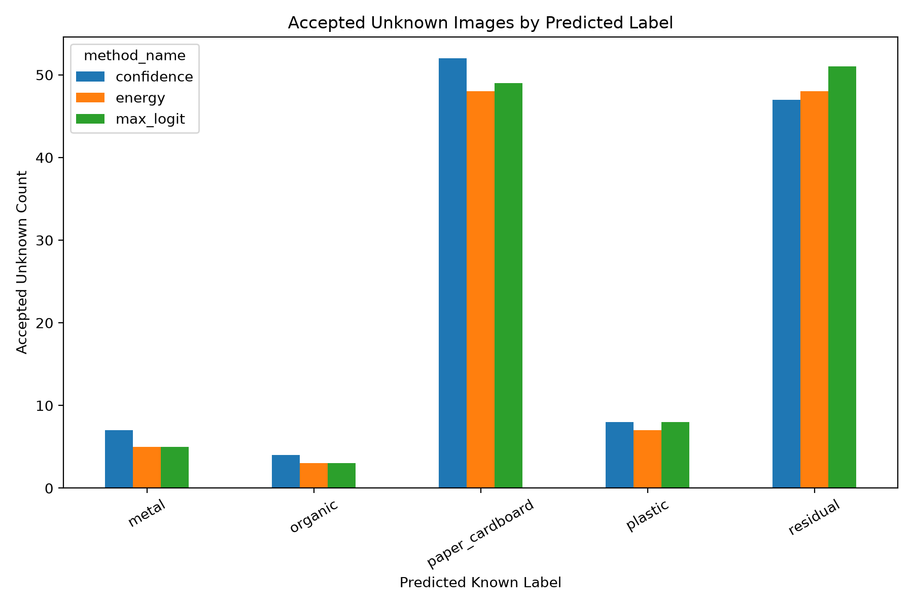

# Local Unknown Evaluation v1

## Purpose

This report evaluates whether the current OpenWaste-HR reject baselines can route local phone-captured unknown images to manual review.

## Known Labels Used by the Model

paper_cardboard, plastic, glass, metal, organic, residual

## Thresholds Used

Thresholds were selected from validation data in earlier experiments. The local unknown set was not used for threshold selection.

| method_name | score_column | threshold | accept_direction |
| --- | --- | --- | --- |
| confidence | max_softmax_confidence | 0.99 | greater_equal |
| max_logit | max_logit_score | 9.59305 | greater_equal |
| energy | energy_score | -9.870391 | less_equal |

## Unknown Rejection Metrics

| method_name | total_unknown_samples | rejected_unknown_count | accepted_unknown_as_known_count | unknown_rejection_rate | unknown_false_acceptance_rate |
| --- | --- | --- | --- | --- | --- |
| confidence | 318 | 200 | 118 | 0.628931 | 0.371069 |
| max_logit | 318 | 202 | 116 | 0.63522 | 0.36478 |
| energy | 318 | 207 | 111 | 0.650943 | 0.349057 |

## Accepted Unknown Label Distribution

| method_name | pred_label | accepted_count | accepted_percentage_within_method |
| --- | --- | --- | --- |
| confidence | metal | 7 | 5.93 |
| confidence | organic | 4 | 3.39 |
| confidence | paper_cardboard | 52 | 44.07 |
| confidence | plastic | 8 | 6.78 |
| confidence | residual | 47 | 39.83 |
| energy | metal | 5 | 4.5 |
| energy | organic | 3 | 2.7 |
| energy | paper_cardboard | 48 | 43.24 |
| energy | plastic | 7 | 6.31 |
| energy | residual | 48 | 43.24 |
| max_logit | metal | 5 | 4.31 |
| max_logit | organic | 3 | 2.59 |
| max_logit | paper_cardboard | 49 | 42.24 |
| max_logit | plastic | 8 | 6.9 |
| max_logit | residual | 51 | 43.97 |

## Rejection Rate Plot

## Accepted Label Distribution Plot

## Research Interpretation

For unknown evaluation, rejection/manual review is the desired behaviour.

Accepted unknown samples are treated as false accepts because the system forced a local unknown item into a known fine label. This result is important because it tests the actual OpenWaste-HR motivation: avoiding unsafe forced predictions on unknown or locally shifted inputs.
