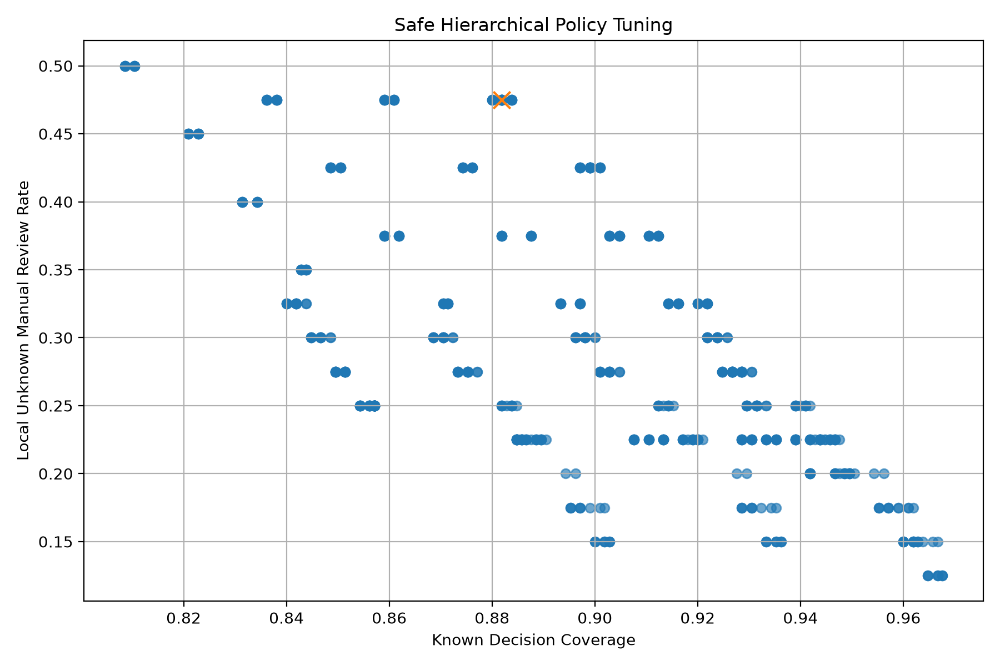

# Safe Hierarchical Policy Tuning v1 Report

## Purpose

This report tunes the OpenWaste-HR hierarchical decision policy to improve local unknown safety while preserving useful known-test decisions.

## Selected Thresholds

| threshold | value |
| --- | --- |
| fine_confidence_threshold | 0.995 |
| coarse_confidence_threshold | 0.99 |
| coarse_margin_threshold | 0.15 |
| minimum_confidence_for_coarse | 0.35 |

## Known-Test Metrics

| metric | value |
| --- | --- |
| known_total_samples | 1050.0 |
| fine_decision_count | 720.0 |
| coarse_fallback_count | 206.0 |
| manual_review_count | 124.0 |
| known_decision_coverage | 0.881905 |
| known_manual_review_rate | 0.118095 |
| hierarchical_success_rate_over_all | 0.867619 |
| hierarchical_success_rate_over_accepted | 0.983801 |

## Local Unknown Metrics

| metric | value |
| --- | --- |
| unknown_total_samples | 40.0 |
| unknown_manual_review_count | 19.0 |
| unknown_fine_accept_count | 13.0 |
| unknown_coarse_accept_count | 8.0 |
| unknown_accepted_count | 21.0 |
| unknown_manual_review_rate | 0.475 |
| unknown_acceptance_rate | 0.525 |

## Decision Distribution

| dataset | decision_type | count | percentage |
| --- | --- | --- | --- |
| known_test | fine_label | 720 | 68.57 |
| known_test | coarse_label | 206 | 19.62 |
| known_test | manual_review | 124 | 11.81 |
| local_unknown | fine_label | 13 | 32.5 |
| local_unknown | coarse_label | 8 | 20.0 |
| local_unknown | manual_review | 19 | 47.5 |

## Top Candidate Policies

| fine_confidence_threshold | coarse_confidence_threshold | coarse_margin_threshold | minimum_confidence_for_coarse | objective_score | known_decision_coverage | hierarchical_success_rate_over_accepted | unknown_manual_review_rate | unknown_acceptance_rate |
| --- | --- | --- | --- | --- | --- | --- | --- | --- |
| 0.995 | 0.99 | 0.15 | 0.35 | 0.709021 | 0.881905 | 0.983801 | 0.475 | 0.525 |
| 0.995 | 0.99 | 0.35 | 0.35 | 0.709021 | 0.881905 | 0.983801 | 0.475 | 0.525 |
| 0.995 | 0.99 | 0.5 | 0.35 | 0.709021 | 0.881905 | 0.983801 | 0.475 | 0.525 |
| 0.995 | 0.99 | 0.65 | 0.35 | 0.709021 | 0.881905 | 0.983801 | 0.475 | 0.525 |
| 0.995 | 0.99 | 0.8 | 0.35 | 0.709021 | 0.881905 | 0.983801 | 0.475 | 0.525 |
| 0.995 | 0.99 | 0.9 | 0.35 | 0.709021 | 0.881905 | 0.983801 | 0.475 | 0.525 |
| 0.995 | 0.99 | 0.15 | 0.5 | 0.70863 | 0.88 | 0.983766 | 0.475 | 0.525 |
| 0.995 | 0.99 | 0.35 | 0.5 | 0.70863 | 0.88 | 0.983766 | 0.475 | 0.525 |
| 0.995 | 0.99 | 0.5 | 0.5 | 0.70863 | 0.88 | 0.983766 | 0.475 | 0.525 |
| 0.995 | 0.99 | 0.65 | 0.5 | 0.70863 | 0.88 | 0.983766 | 0.475 | 0.525 |

## Tuning Plot

## Research Interpretation

The tuned policy is selected by balancing known-test usefulness and local unknown safety.

A safer policy should increase the local unknown manual-review rate while avoiding an excessive drop in useful known-test decisions.

This tuning stage shows that hierarchical fallback must be controlled carefully. Coarse fallback is useful for known-class uncertainty, but if it is too permissive it can still accept unknown images.
