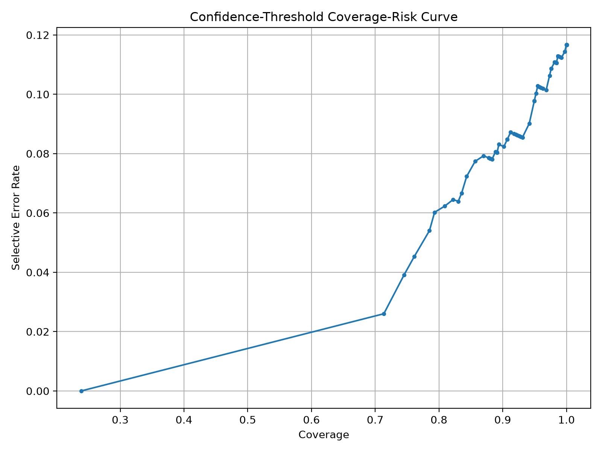
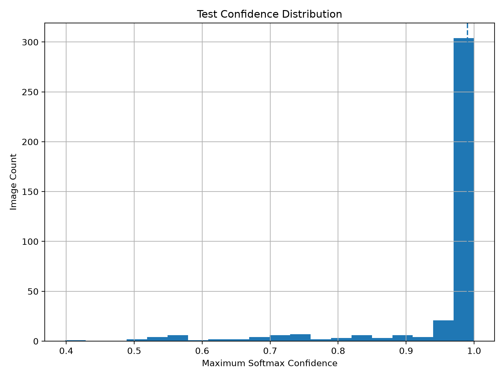

# Confidence-Threshold Reject Baseline v1

## Purpose

This report evaluates a simple reject-option baseline for OpenWaste-HR.

The trained closed-set classifier is allowed to reject low-confidence predictions instead of forcing every image into a known fine label.

## Classes

paper_cardboard, plastic, glass, metal, residual

## Selected Threshold

The threshold was selected using the validation split only.

| item | value |
| --- | --- |
| threshold | 0.99 |
| total_samples | 377.0 |
| accepted_count | 269.0 |
| rejected_count | 108.0 |
| coverage | 0.713528 |
| rejection_rate | 0.286472 |
| forced_accuracy | 0.883289 |
| selective_accuracy | 0.973978 |
| selective_error_rate | 0.026022 |
| selective_macro_f1 | 0.958167 |
| selective_weighted_f1 | 0.974375 |
| selection_metric | selective_macro_f1 |
| min_coverage | 0.7 |

## Validation Metrics After Rejection

| metric | value |
| --- | --- |
| total_samples | 377.0 |
| accepted_count | 269.0 |
| rejected_count | 108.0 |
| coverage | 0.713528 |
| rejection_rate | 0.286472 |
| forced_accuracy | 0.883289 |
| selective_accuracy | 0.973978 |
| selective_error_rate | 0.026022 |
| selective_macro_f1 | 0.958167 |
| selective_weighted_f1 | 0.974375 |

## Test Metrics After Rejection

| metric | value |
| --- | --- |
| total_samples | 384.0 |
| accepted_count | 277.0 |
| rejected_count | 107.0 |
| coverage | 0.721354 |
| rejection_rate | 0.278646 |
| forced_accuracy | 0.888021 |
| selective_accuracy | 0.953069 |
| selective_error_rate | 0.046931 |
| selective_macro_f1 | 0.923975 |
| selective_weighted_f1 | 0.952995 |

## Coverage-Risk Curve

## Test Confidence Histogram

## Research Interpretation

This confidence-threshold baseline is the first safety-oriented baseline after the closed-set classifier.

It measures whether low-confidence predictions can be routed to manual review. This is important because the final OpenWaste-HR system should not only classify known items, but also reduce unsafe confident errors by rejecting uncertain, ambiguous, or unknown inputs.

This is still not the final proposed model. Later stages will add open-set scoring and hierarchical coarse/fine fallback.
