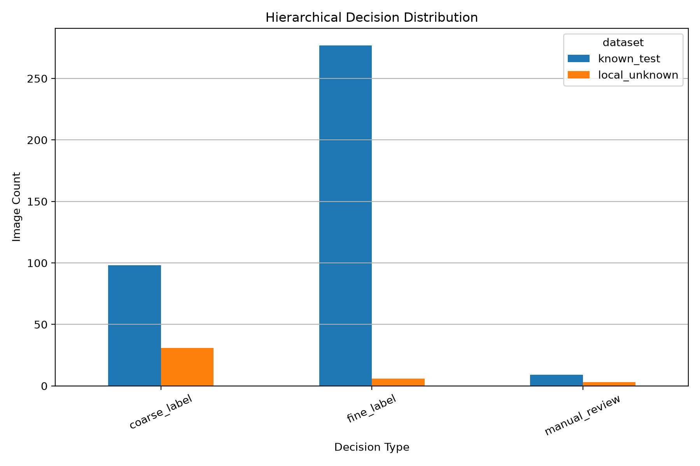

# Hierarchical Decision Policy v1 Report

## Purpose

This report evaluates the first OpenWaste-HR hierarchical decision policy.

The policy can output:

1. fine label
2. coarse label
3. manual review

## Policy Thresholds

| threshold | value |
| --- | --- |
| fine_confidence_threshold | 0.99 |
| coarse_confidence_threshold | 0.8 |
| coarse_margin_threshold | 0.15 |
| minimum_confidence_for_coarse | 0.35 |

## Known-Test Metrics

| metric | value |
| --- | --- |
| known_total_samples | 384.0 |
| fine_decision_count | 277.0 |
| coarse_fallback_count | 98.0 |
| manual_review_count | 9.0 |
| known_decision_coverage | 0.976562 |
| known_manual_review_rate | 0.023438 |
| fine_correct_count | 264.0 |
| coarse_correct_count | 95.0 |
| hierarchical_success_count | 359.0 |
| fine_accuracy_on_fine_decisions | 0.953069 |
| coarse_accuracy_on_coarse_decisions | 0.969388 |
| hierarchical_success_rate_over_all | 0.934896 |
| hierarchical_success_rate_over_accepted | 0.957333 |

## Local Unknown Metrics

| metric | value |
| --- | --- |
| unknown_total_samples | 40.0 |
| unknown_manual_review_count | 3.0 |
| unknown_fine_accept_count | 6.0 |
| unknown_coarse_accept_count | 31.0 |
| unknown_accepted_count | 37.0 |
| unknown_manual_review_rate | 0.075 |
| unknown_acceptance_rate | 0.925 |

## Decision Distribution

| dataset | decision_type | count | percentage |
| --- | --- | --- | --- |
| known_test | fine_label | 277 | 72.14 |
| known_test | coarse_label | 98 | 25.52 |
| known_test | manual_review | 9 | 2.34 |
| local_unknown | fine_label | 6 | 15.0 |
| local_unknown | coarse_label | 31 | 77.5 |
| local_unknown | manual_review | 3 | 7.5 |

## Decision Distribution Plot

## Research Interpretation

This stage moves OpenWaste-HR beyond simple accept/reject thresholding.

The system now has a middle decision level: coarse fallback. This means it does not have to force a detailed fine label when fine confidence is weak. It can return a broader category when coarse evidence is stable, and it can still send unsafe or ambiguous images to manual review.

This directly supports the OpenWaste-HR goal of safer open-world waste classification.
