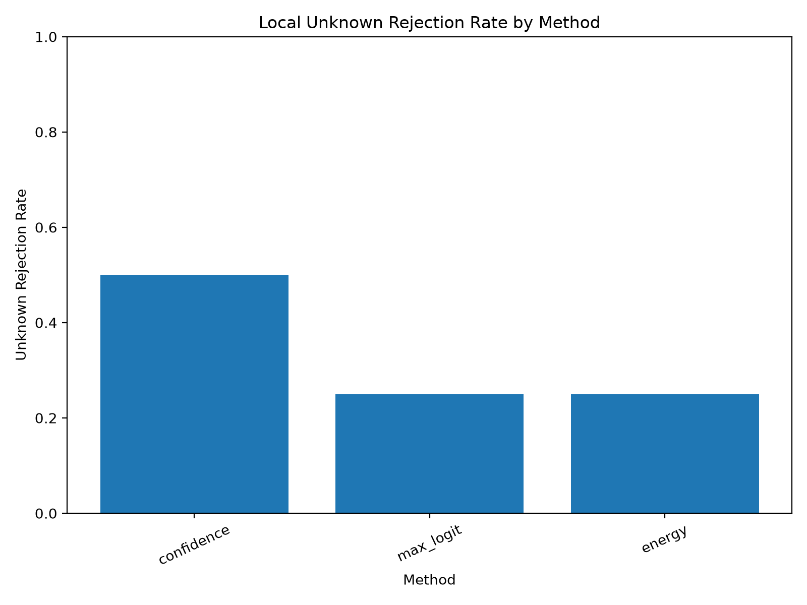
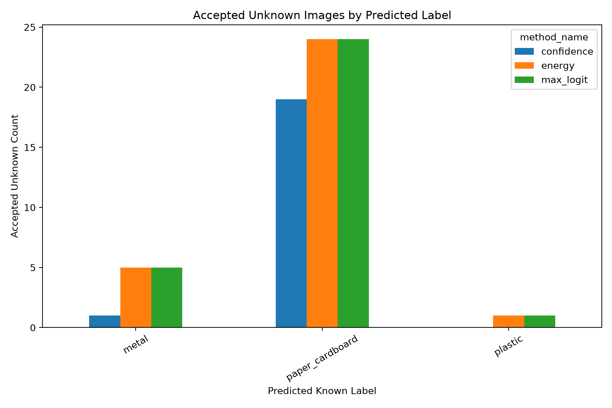

# Local Unknown Evaluation v1

## Purpose

This report evaluates whether the current OpenWaste-HR reject baselines can route local phone-captured unknown images to manual review.

## Known Labels Used by the Model

paper_cardboard, plastic, glass, metal, residual

## Thresholds Used

Thresholds were selected from validation data in earlier experiments. The local unknown set was not used for threshold selection.

| method_name | score_column | threshold | accept_direction |
| --- | --- | --- | --- |
| confidence | max_softmax_confidence | 0.99 | greater_equal |
| max_logit | max_logit_score | 8.021357 | greater_equal |
| energy | energy_score | -7.885723 | less_equal |

## Unknown Rejection Metrics

| method_name | total_unknown_samples | rejected_unknown_count | accepted_unknown_as_known_count | unknown_rejection_rate | unknown_false_acceptance_rate |
| --- | --- | --- | --- | --- | --- |
| confidence | 40 | 20 | 20 | 0.5 | 0.5 |
| max_logit | 40 | 10 | 30 | 0.25 | 0.75 |
| energy | 40 | 10 | 30 | 0.25 | 0.75 |

## Accepted Unknown Label Distribution

| method_name | pred_label | accepted_count | accepted_percentage_within_method |
| --- | --- | --- | --- |
| confidence | metal | 1 | 5.0 |
| confidence | paper_cardboard | 19 | 95.0 |
| energy | metal | 5 | 16.67 |
| energy | paper_cardboard | 24 | 80.0 |
| energy | plastic | 1 | 3.33 |
| max_logit | metal | 5 | 16.67 |
| max_logit | paper_cardboard | 24 | 80.0 |
| max_logit | plastic | 1 | 3.33 |

## Rejection Rate Plot

## Accepted Label Distribution Plot

## Research Interpretation

For unknown evaluation, rejection/manual review is the desired behaviour.

Accepted unknown samples are treated as false accepts because the system forced a local unknown item into a known fine label. This result is important because it tests the actual OpenWaste-HR motivation: avoiding unsafe forced predictions on unknown or locally shifted inputs.
