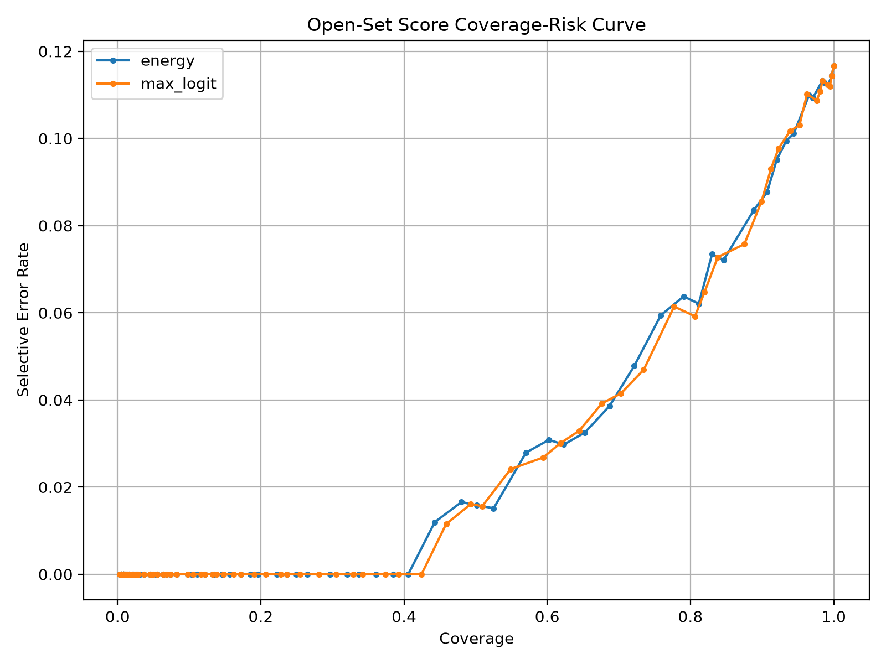
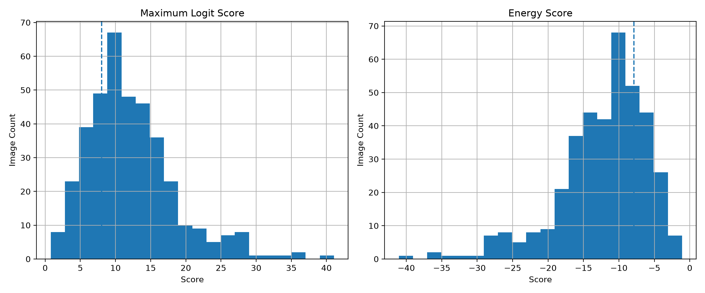

# Open-Set Score Reject Baseline v1

## Purpose

This report evaluates two logit-based reject baselines:

1. Maximum Logit Score
2. Energy Score

The goal is to compare these against the previous softmax-confidence reject baseline.

## Classes

paper_cardboard, plastic, glass, metal, residual

## Selected Thresholds

Thresholds were selected using the validation split only.

| score_name | threshold | accept_direction | validation_coverage | validation_selective_accuracy | validation_selective_macro_f1 |
| --- | --- | --- | --- | --- | --- |
| max_logit | 8.021357 | greater_equal | 0.702918 | 0.958491 | 0.948101 |
| energy | -7.885723 | less_equal | 0.721485 | 0.952206 | 0.941689 |

## Test Metrics

| score_name | metric | value |
| --- | --- | --- |
| max_logit | total_samples | 384.0 |
| max_logit | accepted_count | 282.0 |
| max_logit | rejected_count | 102.0 |
| max_logit | coverage | 0.734375 |
| max_logit | rejection_rate | 0.265625 |
| max_logit | forced_accuracy | 0.888021 |
| max_logit | selective_accuracy | 0.957447 |
| max_logit | selective_error_rate | 0.042553 |
| max_logit | selective_macro_f1 | 0.942696 |
| max_logit | selective_weighted_f1 | 0.957535 |
| energy | total_samples | 384.0 |
| energy | accepted_count | 286.0 |
| energy | rejected_count | 98.0 |
| energy | coverage | 0.744792 |
| energy | rejection_rate | 0.255208 |
| energy | forced_accuracy | 0.888021 |
| energy | selective_accuracy | 0.958042 |
| energy | selective_error_rate | 0.041958 |
| energy | selective_macro_f1 | 0.94345 |
| energy | selective_weighted_f1 | 0.95813 |

## Coverage-Risk Plot

## Score Histogram Plot

## Research Interpretation

This stage prepares OpenWaste-HR for true open-set and unknown-item evaluation.

Maximum logit and energy scoring use raw model logits instead of only softmax confidence. This is important because later unknown and local difficult images may expose overconfident softmax behaviour.

Current limitation: this report still evaluates selective classification on known TrashNet test images. The next dataset stage must introduce held-out unknown and local unknown images to test true unknown detection.
